

<h1>KittyShare</h1>

A very simple file-sharing application for your server.

> [!IMPORTANT]
> This project is still under heavy development and cannot be considered "ready".

The project allows for the sharing of files and folders inside of the
filesystem. These files and folders are always readonly and return the current
state they are in.

As such the application creates a nice web interface for the files that are
intended to be distributed for other people.

## Screenshots

To see how the application looks like, it is often useful to see some screenshots:
|        Page         |                                                          Light Mode                                                           |                                                          Dark Mode                                                          |
| :-----------------: | :---------------------------------------------------------------------------------------------------------------------------: | :-------------------------------------------------------------------------------------------------------------------------: |
|    Share screen     | 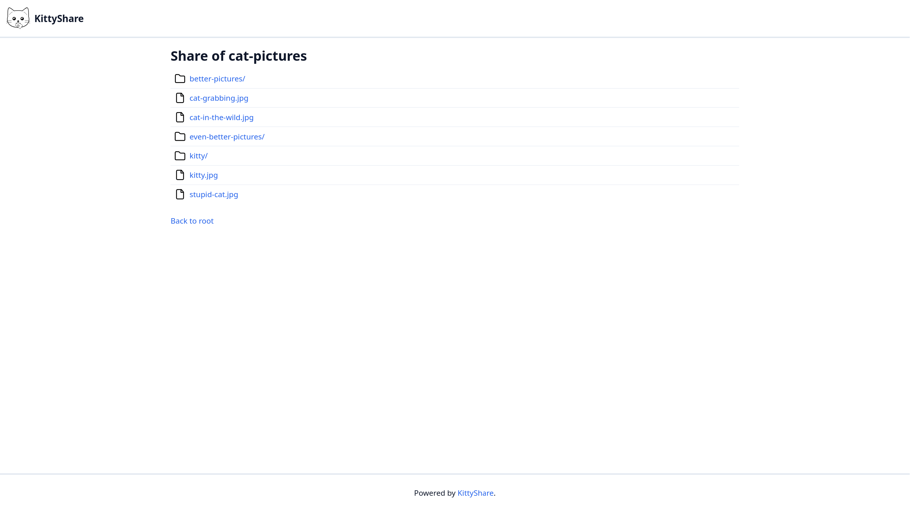 | 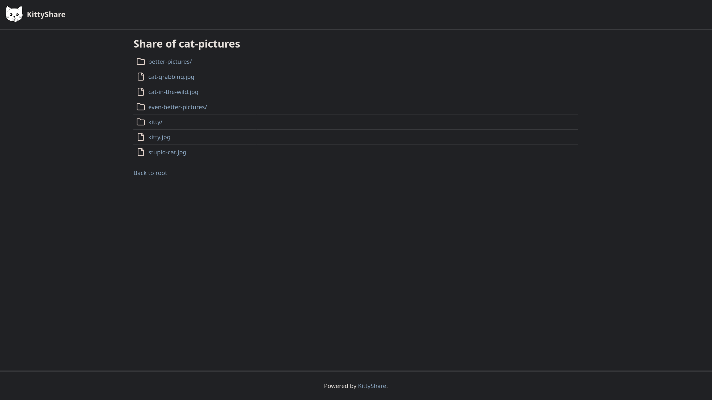 |
|    Setup screen     | 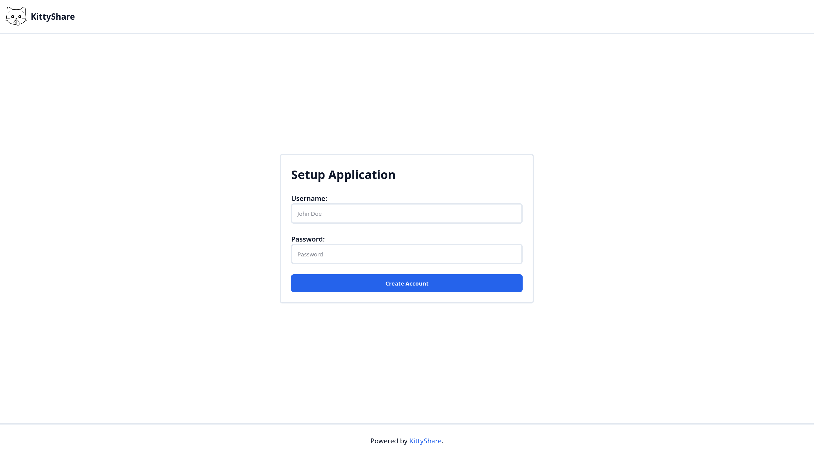  | 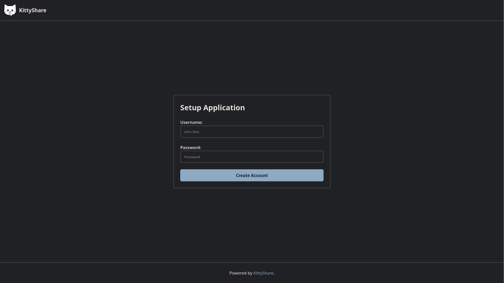  |
|    Login screen     | 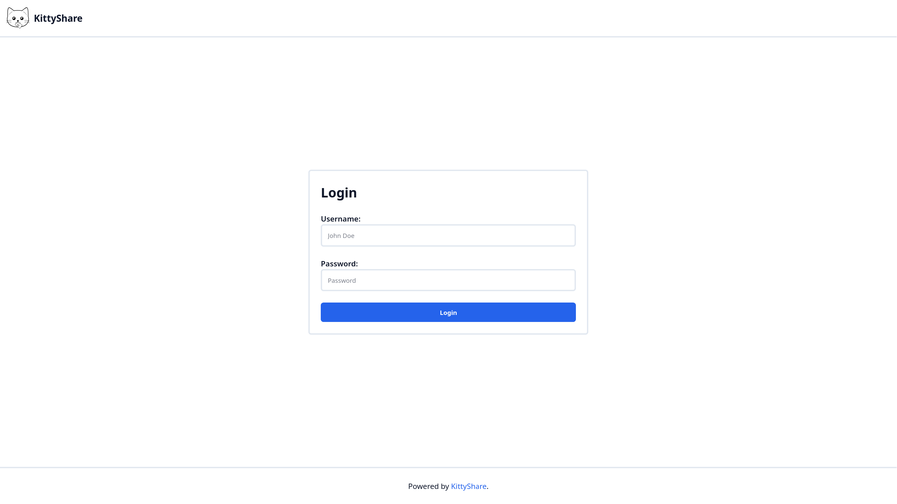  | 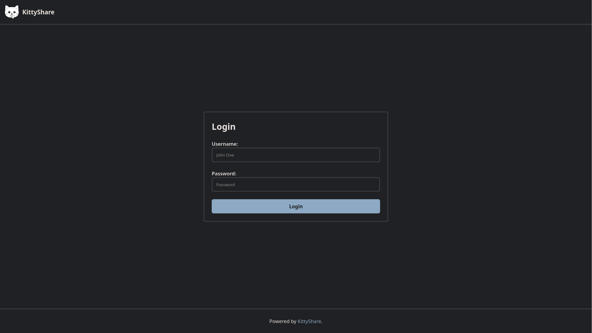  |
|    Admin screen     |     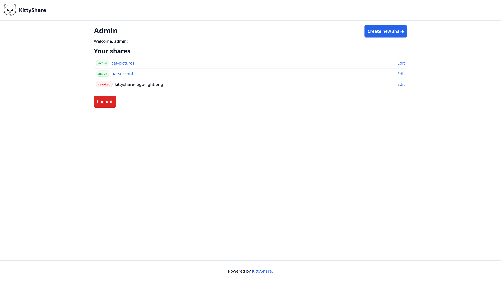     |     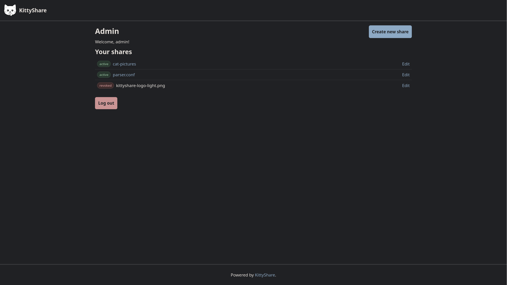      |
|    Browse screen    | 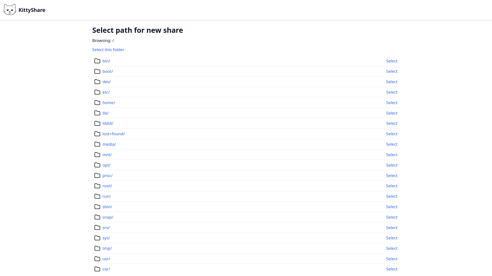 | 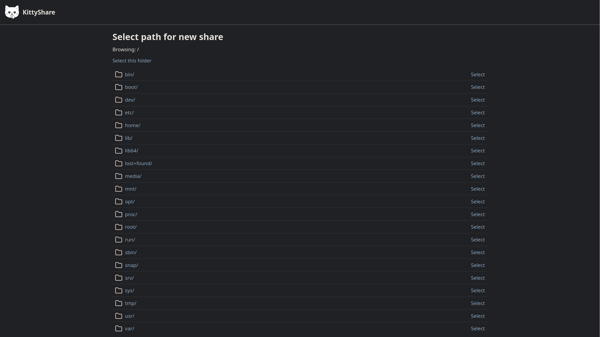 |
| Create share screen |        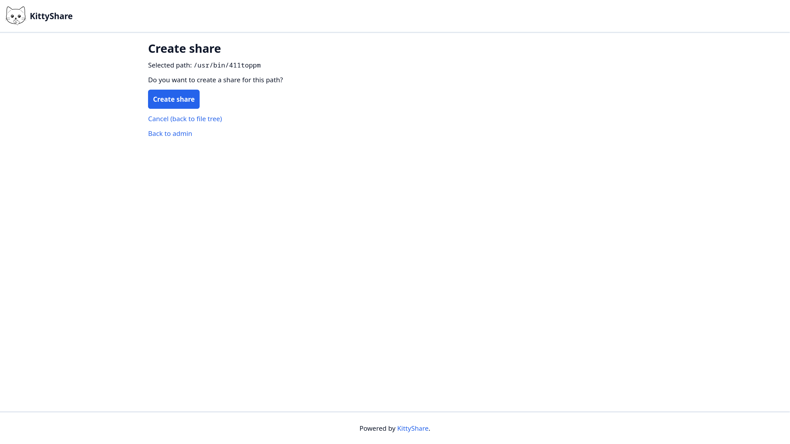        |        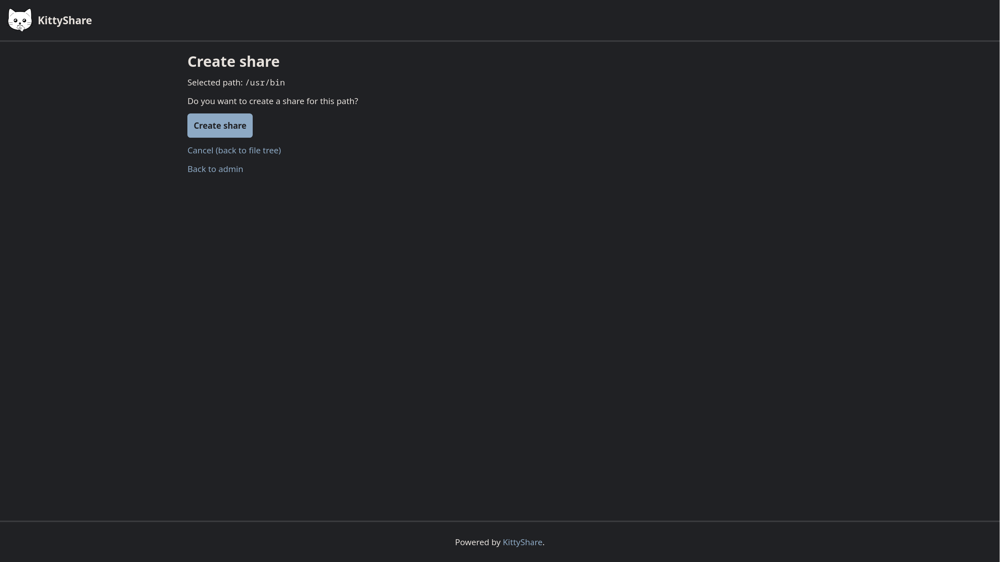        |
| Manage share screen |        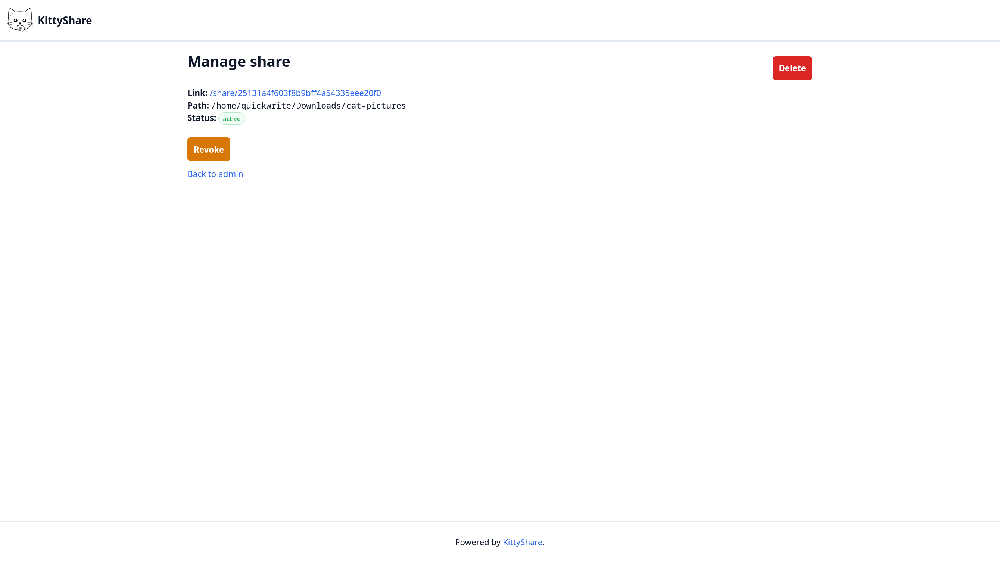        |        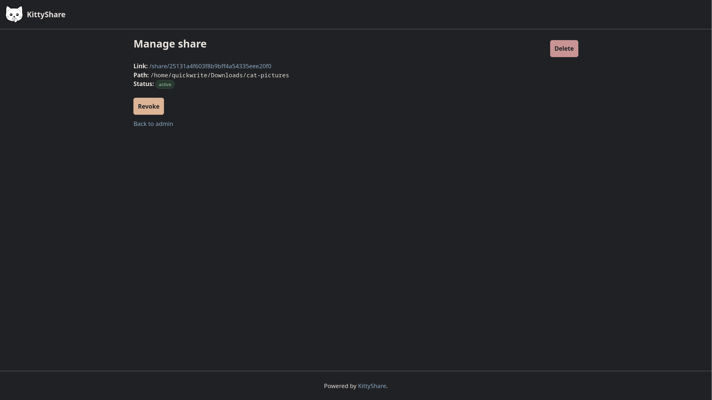        |

## Project Structure

The project is a PHP 8.4 application with no dependencies. The project is still
using Composer to manage development dependencies and the autoloader. The
application is mainly using a SQLite database as it's backend.

All files that are meant for the enduser to access are in the
[`public/`](public)-folder. This folder contains the assets and the `index.php`
as the jumping in point for the application.

Internal PHP files can be found in the [`src/`](src)-folder. It is divided into:
- `Filesystem` - The accesspoint of the application to the filesystem.
- `Http`       - Everything that has to do with the request and response. As such the Router and the response classes are in here.
- `Manager`    - The classes that do not directly access resources, but manage these based on the repositories.
- `Repository` - A simple abstraction of a specific resource. For example the SQLite database.
- `Controller` - The classes that decide on what to do with the request. They call the correct repositories, managers and return some response object.
- `Model`      - The classes that model the data that can be found in the project
- `Template`   - Templates that return HTML based on the data. They are also PHP files.

The project can also be built into a Docker container which uses PHP 8.5 with
the Apache web server.

## License

This project is licensed under the permissive [MIT-License](LICENSE).
